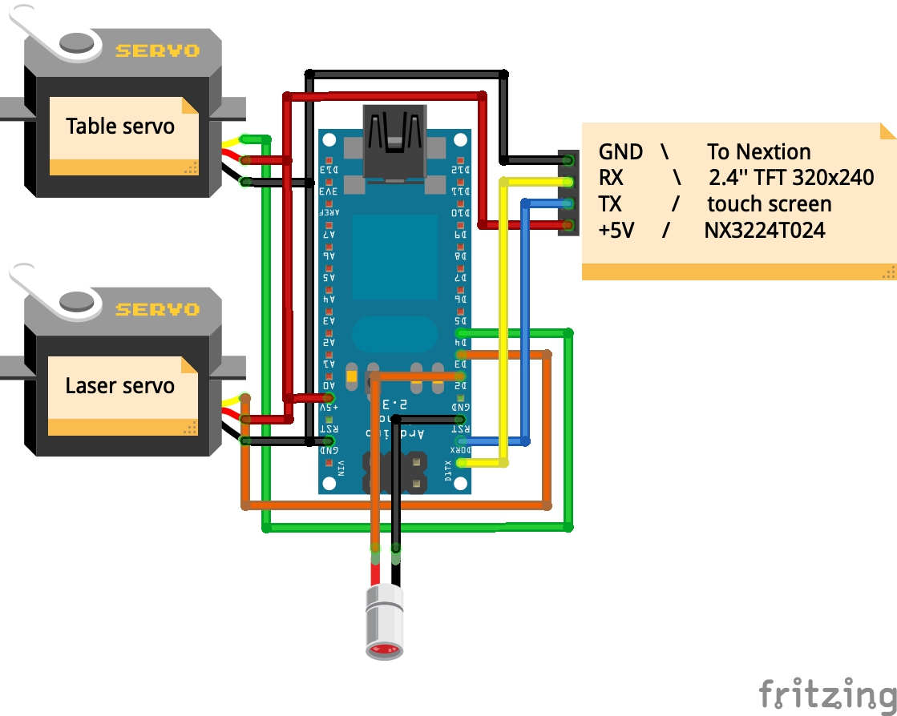
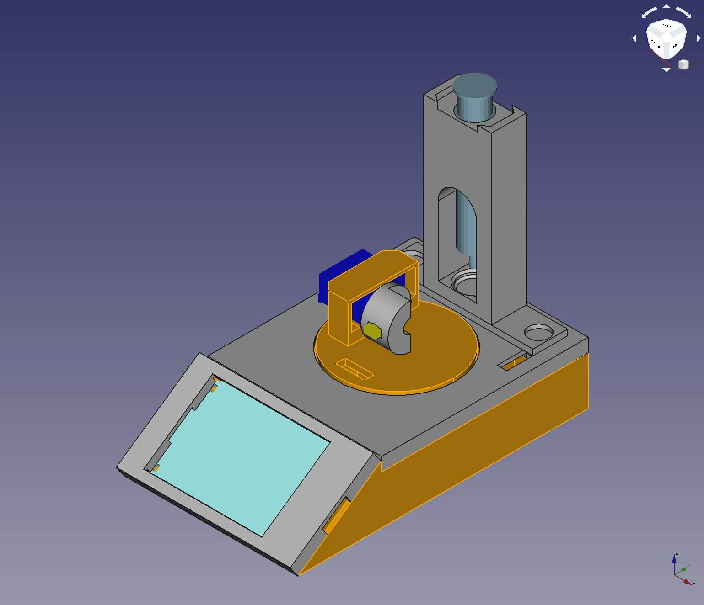

# Laser projection microscope

This document is still under construction.

*This repository contains all the informations about the design of a motorized laser projection microscope.*

## Required parts

|Name|Link on Amazon.fr/Conrad.fr|Price (in euros)|Required|Actual cost (in euros)|
|---|---|---|---|---|
|Touch screen|[Nextion 2.4" TFT 320 x 240 Resistive Touch Screen UART HMI Smart raspberry pi LCD Module Display For Arduino TFT](https://www.amazon.fr/gp/product/B01FR43VL8/ref=ppx_yo_dt_b_asin_title_o00_s00?ie=UTF8&psc=1)|19.68|1|19.69|
|Servo|[Kuman KY66 Micro Servomoteur SG90 10pcs, 9G Robot Contrôle D'hélicoptère, Avion, Bateau, Mini Servo 450](https://www.amazon.fr/gp/product/B01MXPTCHO/ref=oh_aui_detailpage_o05_s00?ie=UTF8&psc=1)|23.00/10pcs|1|2.30|
|Laser diode|[Diode laser Module tube cuivre rouge en forme de tête dot DC 5V 5mW 650nm 6mm 10pcs](https://www.amazon.fr/10pcs-Diode-laser-Module-cuivre/dp/B00JTRK4U6/ref=sr_1_fkmr0_1?__mk_fr_FR=%C3%85M%C3%85%C5%BD%C3%95%C3%91&keywords=Diode+Laser+Module+Tube+Cuivre+Rouge+En+Forme+De+T%C3%AAte+Dot+DC+5V+5mW+650nm+6mm&qid=1568831597&s=industrial&sr=8-1-fkmr0)|1.82/10pcs|1|0.18|
|10x2mm magnets|[Aimant de néodyme 10 mm de diamètre x 2 mm d'épaisseur avec 2.2 kg Traction 50 Pcs](https://www.amazon.fr/gp/product/B06X977K8L/ref=ppx_yo_dt_b_search_asin_title?ie=UTF8&psc=1)|9.95/50pcs|4|0.80|
|Arduino Nano|[Kuman 10 x Mini Nano V3.0 ATmega328P 5V 16M Micro Controller Board Module pour Arduino KY64-10](https://www.amazon.fr/gp/product/B01NCM5W9O/ref=oh_aui_detailpage_o08_s00?ie=UTF8&psc=1)|32,80/10pcs|1|3.28|
|USB Cable|[AmazonBasics USB 2.0 Cable - A-Male to Mini-B - 6 Feet (1.8 Meters)](https://www.amazon.fr/gp/product/B00NH11N5A/ref=oh_aui_detailpage_o04_s00?ie=UTF8&psc=1)|5.95|1|5.95|
|PLA Filament Black|[ICE Filaments ICEFIL PLA Filament, 1.75 mm, 0.75 kg](https://www.amazon.fr/ICE-FILAMENTS-ICEFIL1PLA119-Filament-Wintershine/dp/B017HAHUYO/ref=sxts_sxwds-bia-wc3_0?__mk_fr_FR=%C3%85M%C3%85%C5%BD%C3%95%C3%91&keywords=PLA&pd_rd_i=B017HAIMZU&pd_rd_r=7069def4-2677-4c0b-b2df-f58776026669&pd_rd_w=d3ZPg&pd_rd_wg=0AJ00&pf_rd_p=456c8c63-4acb-4e17-98db-87a0af8674c6&pf_rd_r=SPGQ0AVB7YN5JXYFAFDW&qid=1568832364&s=gateway&th=1)|16.94/750g|XXXg|XXX|
|Super glue|[Loctite Colle forte/ Super Glue 3 - Universal - 3 g - Lot de 2](https://www.amazon.fr/Loctite-Colle-forte-Super-Glue/dp/B008F7YFS8/ref=sr_1_1?ie=UTF8&qid=1514664075&sr=8-1&keywords=super+glue)|5.75/2pcs|1|2.87|
|**Total**||**XXXX**||**XXXX**|

## Required tools

|Name|Link on Amazon.fr|Price (in euros)|
|---|---|---|
|Soldering iron|[HOMASY Kit de Fer à Souder Réglable 60W Soudage Electrique avec 5 PCS Points Différents, Pompe à Dessouder, Support, Brucelles anti-statiques et Fil de Soudure](https://www.amazon.fr/gp/product/B01HY1A26Y/ref=oh_aui_search_detailpage?ie=UTF8&psc=1)|18.59|
|3D printer|[Creality CR10S](https://www.amazon.fr/Imprimante-3D-Creality-CR-10S-contr%C3%B4le/dp/B07NZ3WXRB/ref=sr_1_5?__mk_fr_FR=%C3%85M%C3%85%C5%BD%C3%95%C3%91&keywords=CR10S&qid=1568832625&s=gateway&sr=8-5)|450|
|Hobby Knife|[Wedo Hobby Knife Set - Silver](https://www.amazon.fr/Wedo-078722-couteau-bricolage-recHange/dp/B001ALYPY0/ref=sr_1_2?ie=UTF8&qid=1514662864&sr=8-2&keywords=cutter+de+pr%C3%A9cision)|6.40|
|**Total**||**474.99**|

## How does it work ?

### Electronic design

The electronic design is pretty simple. A [Fritzing scheme](Fritzing/Laser_Projection_Microscope.fzz) is enclosed in this repository:

### 3D printed parts
A [FreeCAD file](FreeCAD/Laser_Projection_Microscope.FCStd) and [STL files](STL/) are provided as part of this repository, allowing to print the enclosure for the circuit board, the support for the servos and the laser.

### Programming
A [Arduino script](Arduino/ALaser_Projection_Microscope.ino) is available from the repository. 

The touchscreen can be programmed using the [script](ToucheScreen/Laser_Projection_Microscope.HMI) available in the repository.
